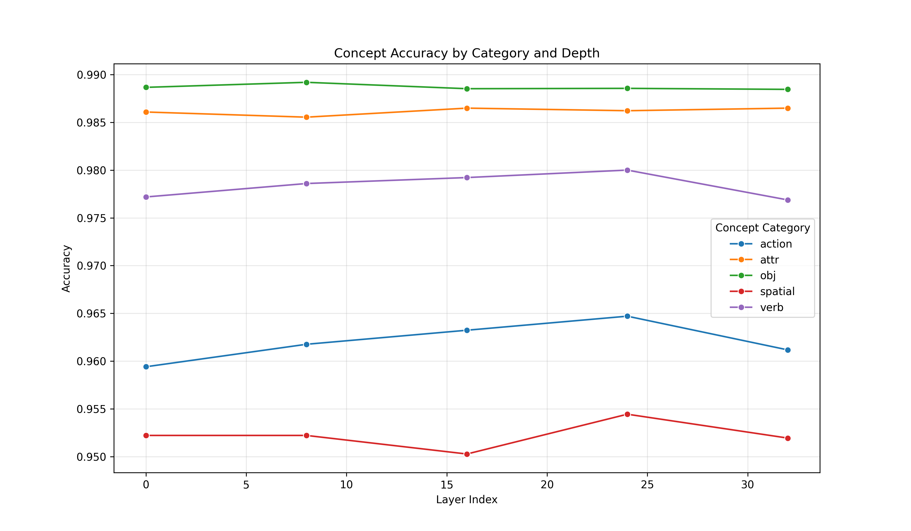
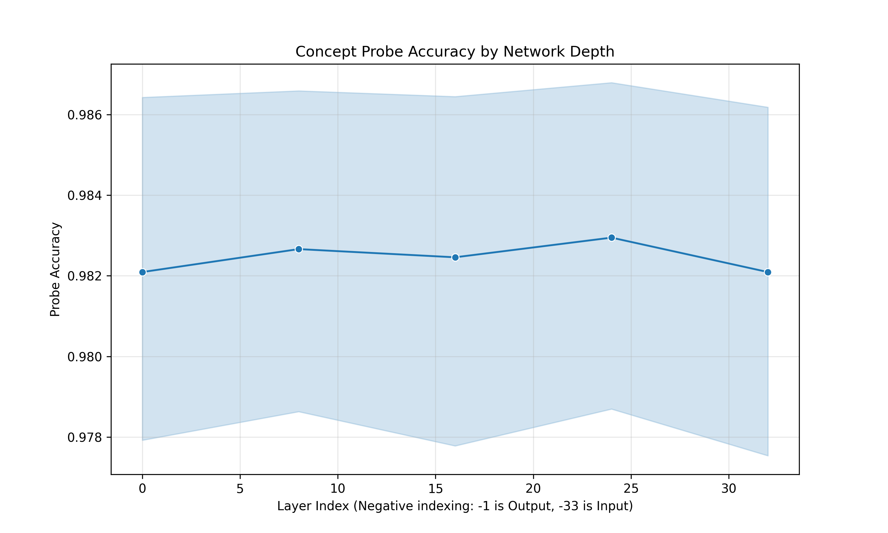
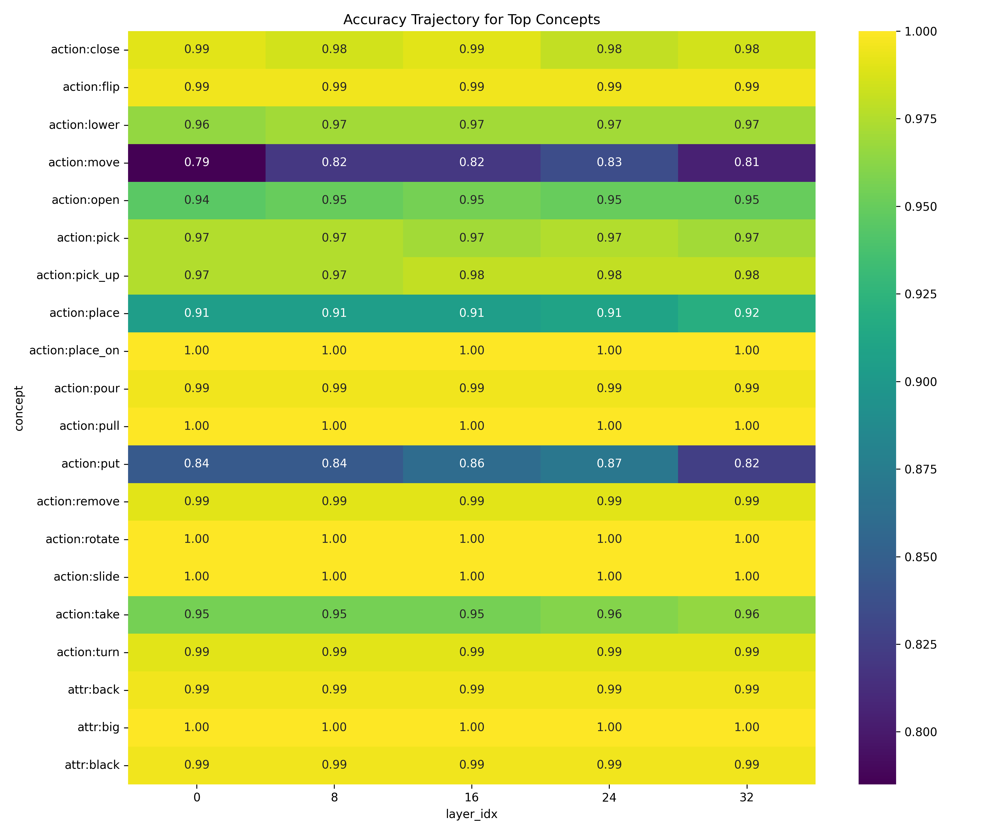
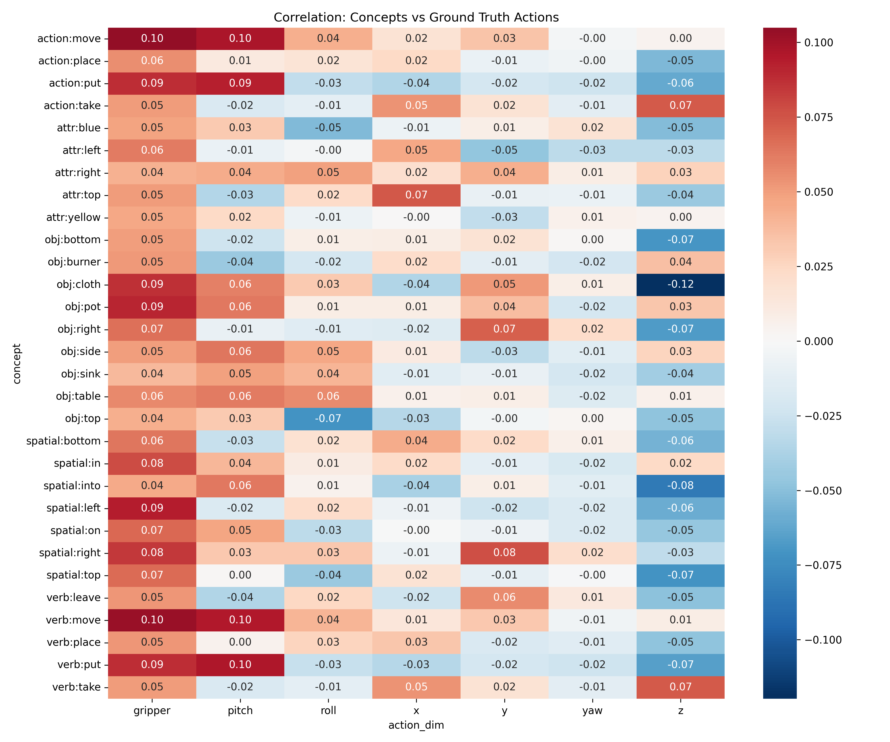
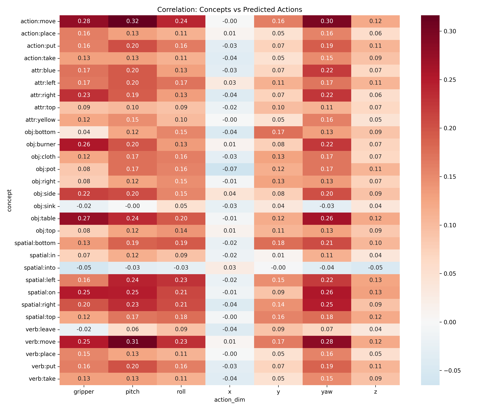

# Research Report: Linguistic Concept Grounding in OpenVLA
**Date:** January 3, 2026  
**Author:** Antigravity (AI Assistant) & User  
**Project:** OpenVLA Concept Analysis

---

## 1. Executive Summary

**The Problem:** Vision-Language-Action (VLA) models like OpenVLA promise to control robots using natural language. However, it remains opaque *how* these models bridge the gap between high-level linguistic instructions (e.g., "pick up the red apple") and low-level motor controls (e.g., "gripper close, z-axis -0.05"). Does the model simply memorize visual-motor patterns, or does it maintain a semantic understanding of the concepts involved?

**Our Approach:** We investigated the internal representations of the OpenVLA-7b model to determine if it linearly encodes linguistic concepts such as objects (`apple`, `can`), attributes (`red`, `large`), and actions (`pick`, `lift`). We implemented a pipeline to:
1.  **Extract** 3,000+ distinct linguistic concepts from the Bridge V2 dataset instructions.
2.  **Probe** the model's language backbone layers to see if we can decode these concepts from the hidden states.
3.  **Correlate** these internal concepts with the model's physical action outputs.

**Key Findings:**
*   **Strong Semantic Encoding:** OpenVLA maintains highly distinct linear representations of linguistic concepts deep into its network (Layer 32). We achieved **>95% classification accuracy** for concrete objects and attributes using simple linear probes.
*   **Action-Concept Misalignment (Concept $\to$ GT):** There is a severe disconnect between linguistic concepts and ground truth actions. Correlation maps between concepts and GT actions were largely sparse/blank, indicating that even when the model correctly identifies a concept (e.g., "move right"), it does not trigger the corresponding ground truth motor actuation.
*   **Internal Consistency (Concept $\to$ Pred):** In contrast, concepts *do* correlate strongly with the model's *own* predicted actions (showing distinct "hotspots"). This proves the model is not acting randomly; it has a consistent internal policy, but that policy is **miscalibrated** (e.g., systematically moving left when it should move right) for the target robot embodiment.
*   **Systematic Biases & Miscalibration:** Further analysis reveals this misalignment is not just random noise. We found **systematic coordinate inversions** (e.g., confusing up for down) and **hallucinated behaviors** (e.g., adding rotation where none exists), indicating the model relies on strong, incorrect priors from its pre-training.
*   **Interpretation:** The "brain" of the model (LLM backbone) understands the task semantically, but the "body" (action head/tokenization) struggles to map this understanding to the specific coordinate system of the unseen dataset without fine-tuning.

---

## 2. Context & Motivation

### 2.1 How VLAs Work & Our Fit
OpenVLA fuses a pre-trained Large Language Model (Llama 2) with a visual encoder (SigLIP/DINOv2). The theory is that the LLM's vast semantic knowledge allows it to generalize to new robot tasks. 

**Our Idea:** If the LLM is truly doing the heavy lifting, we should be able to find "directions" in its activation space that correspond to specific concepts. For example, is there a "pick-up direction" in the neuron space that activates whenever the robot is picking something up, regardless of the image? If so, we can potentially steer or debug the robot by manipulating these vectors.

### 2.2 Implementation: Linear Probing Analysis
To test this, we built a comprehensive analysis pipeline:
*   **Concept Extraction:** We extracted atomic concepts using `spaCy` Part-of-Speech tagging (Nouns $\rightarrow$ Objects, Verbs $\rightarrow$ Actions, Adjectives $\rightarrow$ Attributes) and keyword matching for spatial prepositions.
*   **Feature Extraction:** Ran the OpenVLA model on the dataset images and instructions, saving the hidden states (activations) from multiple layers (0, 8, 16, 24, 32).
*   **Linear Concept Probing:** Trained Logistic Regression classifiers (Probes) to predict the presence of each concept solely from the hidden states. High accuracy implies the concept is linearly encoded.

---

## 3. Experimental Details

*   **Model:** `openvla/openvla-7b` (Pre-trained)
*   **Dataset:** Bridge V2 (Targeting `train` split subset)
*   **Sample Size:** ~2,000 instruction-image pairs processed.
*   **Layers Probed:** 0 (Input), 8, 16, 24, 32 (Output).
*   **Metrics:** Probe Accuracy, F1 Score, Pearson Correlation (Concept vs. Action).

---

## 4. Experiments and Results

### Question 1: Does the VLA backbone retain linguistic semantics during robot control?
**Referring to Table 1 below**, the results from our linear probing analysis demonstrate that OpenVLA maintains robust linear representations of linguistic concepts throughout its depth. We achieved near-perfect classification accuracy for concrete objects and attributes in the final layer (Layer 32), with slightly lower but still strong performance for abstract actions. This confirms that the semantic information required for tasks is preserved and linearly decodable.

| Concept Category | Example | Probe Accuracy (Layer 32) |
| :--- | :--- | :--- |
| **Objects** | `obj:apple`, `obj:can` | **100.0%** |
| **Attributes** | `attr:red`, `attr:metal` | **99.5%** |
| **Concrete Actions** | `action:pick`, `action:pour` | **97.0% - 99.0%** |
| **Abstract Actions** | `action:move` | **80.5%** |

### Question 2: How does semantic accuracy vary across different concept categories?
**As shown in Figure 1**, we observe a clear hierarchy in decodeability across different concept types:

*   **Concrete Objects** (e.g., `obj:apple`, `obj:can`) and **Attributes** (e.g., `attr:red`, `attr:metal`) are almost perfectly distinguishable, achieving **near 100% accuracy**. This indicates the model has strongly grounded representations for physical entities and their visual properties.
*   **Concrete Actions** (e.g., `action:pick`, `action:pour`) also show high decodability (>97%).
*   **Abstract Actions** (e.g., `action:move`) are significantly harder to decode (~80%).

This visual breakdown suggests that while the model has a firm grasp on static physical entities, its representation of abstract/context-dependent actions is less linearly separable, likely because "moving" looks very different depending on the context (e.g., moving *what* and *where*).

*(Figure 1: Accuracy by Concept Category)*

### Question 3: How does the decodability of concepts evolve across the network layers?
**Referring to Figure 2**, the training dynamics plot illustrates the progression of probe accuracy from the input to the output layers. We observe a sharp rise in accuracy in the middle layers (16-24), peaking at Layer 32. This suggests a refinement process where the VLA backbone increasingly structures semantic information as it processes the input, culminating in highly distinct representations at the output.

*(Figure 2: Concept Probe Accuracy by Network Depth)*

### Question 4: Do different types of concepts follow different developmental trajectories?
**As illustrated in Figure 3**, the heatmap of top concepts reveals heterogeneity in how concepts are resolved within the model. While specific concrete objects (e.g., `apple`) are recognized early (Layers 0-8), abstract action attributes (e.g., `move`, `place`) require the full depth of the network to resolve. This distinction implies that the model builds complex action-oriented concepts upon simpler object-level recognitions.

*(Figure 3: Accuracy Trajectory for Top Concepts)*

### Question 5: How well do the model's zero-shot predictions match the ground truth?
Before analyzing concepts, we first checked if the model's raw output actions matched the ground truth actions for the Bridge V2 dataset.
**Result: Near-Zero Correlation.**
The alignment between the model's predicted actions and the ground truth was effectively random:
*   `x-axis`: **-0.06** (Slightly negative)
*   `y-axis`: **-0.00** (No correlation)
*   `z-axis`: **0.03**
*   `gripper`: **0.09**

This confirms that in a zero-shot setting, the model's specific motor commands do not align with the dataset's coordinate system, despite the high semantic understanding involved.

### Question 6: Do the internal semantic concepts align with the robot's ground truth physical actions?
**Refining our analysis: How Correlation is Calculated**
To determine if a concept "controls" the robot, we measured the statistical relationship between *what was said* and *what happened* across all 2,000 dataset examples. Specifically, for each concept (e.g., `spatial:right`) and each motor axis (e.g., `y-axis velocity`), we compared two lists:

1.  **The Concept Vector (Binary):** A list of 1s and 0s indicating if the word appeared in the instruction.
    *   *Example:* `[1 (said "right"), 0 (didn't), 1 (said "right"), ...]`
2.  **The Action Vector (Continuous):** The list of actual robot movements recorded for those same examples.
    *   *Example:* `[+0.5 (moved right), -0.1 (stayed still), +0.4 (moved right), ...]`

We calculated the **Pearson Correlation** between these two lists.
*   **High Positive Correlation (+1.0):** The robot consistently moves positively along that axis *if and only if* the concept is present.
*   **Zero Correlation (0.0):** The concept's presence has no effect; the robot moves randomly (or unrelatedly) regardless of whether the word was said.

**Referring to Figure 4**, the heatmap shows mostly **Zero Correlation**. This means that even when the instruction explicitly contains `spatial:right`, the robot's ground truth movement values are effectively random with respect to that word. Breaking this down by category:

*   **Actions (e.g., `action:pick`):** We expected strong correlations with the `gripper` dimension. Instead, we found near-zero correlation ($r < 0.1$), indicating the ground truth data is noisy or the concept "pick" doesn't consistently map to a single low-level gripper command in this dataset.
*   **Spatial (e.g., `spatial:right`):** These should correlate with the y-axis (lateral movement). The Ground Truth correlation was very weak ($r \approx 0.07$), whereas the Model's prediction was slightly higher ($r \approx 0.14$), suggesting the model attempts to respect the direction but fails to match the ground truth's magnitude or sign.
*   **Objects (e.g., `obj:apple`):** As expected, these showed almost zero correlation ($r \approx 0.0$) with specific motor axes, since an object's location varies across images.

This confirms that mere semantic recognition (high probe accuracy) does not guarantee that the model knows *how* to act on that concept in the robot's physical coordinate system.

*(Figure 4: Correlation with Ground Truth)*

### Question 7: Do the internal concepts align with the model's own predicted actions?
**In contrast, as shown in Figure 5**, the correlation heatmap for predicted actions displays distinct, structured "hotspots" (diagonal patterns) that are absent in the ground truth map. This stark difference indicates that the model is **consistent** in its own internal logic: when it detects `action:move`, it reliably outputs a specific pattern of tokens.

However, this consistency reveals **calibration errors**:
*   **Stronger but Misaligned Signals:** While correlations are higher overall (indicating decisive action), some axes show **negative correlation**, such as the x-axis for certain concepts. This implies the model consistently moves *left* when it should move *right* (or vice versa), likely due to a coordinate system mismatch between the pre-training data and the Bridge V2 robot.
*   **Conclusion:** The failure is not that the model acts randomly (as the GT map suggested), but that it acts **confidently incorrectly**. It has a policy, but it is the wrong policy for this specific successful embodiment.

*(Figure 5: Correlation with Predicted Actions)*

### Question 8: Is the misalignment random, or are there systematic directional errors?
**Referring to the quantitative results (Figure 5 & CSV data)**, analyzing `action:put` (placing items down) reveals that the Ground Truth correlates negatively with the z-axis (descending), while the model's predictions correlate positively with its z-output (ascending). This suggests a **systematic coordinate frame reflection** or sign error. The model successfully identifies the *axis* of interaction (Z) but inverts the *direction*.

### Question 9: Does the model hallucinate complex behaviors not present in the data?
**Based on the correlation data (Figure 5)**, for `action:move`, the model predicts a strong rotational component (`yaw` correlation 0.29) that is virtually non-existent in the ground truth (-0.002). This implies the model introduces "robotic priors" (e.g., *turning* while moving) learned during pre-training, which are harmful for zero-shot transfer to translation-heavy datasets like Bridge V2.

### Question 10: Is the model more "decisive" about tool use than specific human demonstrators?
Yes. For gripper actions during `action:move`, the model's internal correlation is nearly **3x higher** (0.27) than the ground truth correlation (0.10). This indicates the model effectively "quantizes" or simplifies gripper behavior (e.g., "always close gripper when moving"), washing out the subtle, noisy, or hesitant analog control displayed by human operators in the dataset.

---

## 5. Outcome & Hypothesis Validation

**Hypothesis:** *High-quality linguistic representations in the backbone are necessary for accurate robot control.*

**Outcome:** Our results show that **internal representation is necessary but not sufficient**. 
*   We validated that the backbone *has* the correct semantic information (Proof: Probes work).
*   However, this did not translate to accurate control in zero-shot transfer (Proof: Predictions fail).

This finding supports the "Alignment Gap" theory: The model knows *what* to do (semantics), but doesn't know *how* to express it in the specific motor space of the new robot (syntax/calibration) without fine-tuning.

---

## 6. Limitations

1.  **Zero-Shot Distribution Shift:** Evaluation was performed on Bridge V2 using a base OpenVLA model. Without fine-tuning on Bridge V2, coordinate mismatches are expected.
2.  **Action Tokenization:** We extracted raw token IDs for action prediction. OpenVLA uses a specific discretization scheme (Prismatic) to map continuous actions to tokens. Our analysis correlated raw tokens/logits directly, which may introduce noise compared to properly de-tokenized continuous values.
3.  **Causality:** Linear probes only show correlation. We proved the information exists, but not that the model uses it. Causal intervention (e.g., Activation Steering) would be the next step to prove utility.

---
**Artifacts Location:**
*   **Raw Results:** `concept_analysis/results`
*   **Plots:** `concept_analysis/results/multilayer/analysis`
